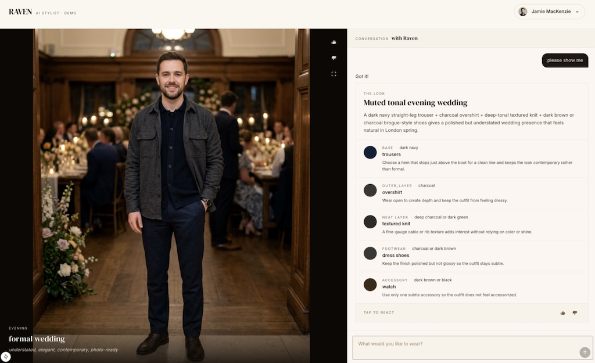
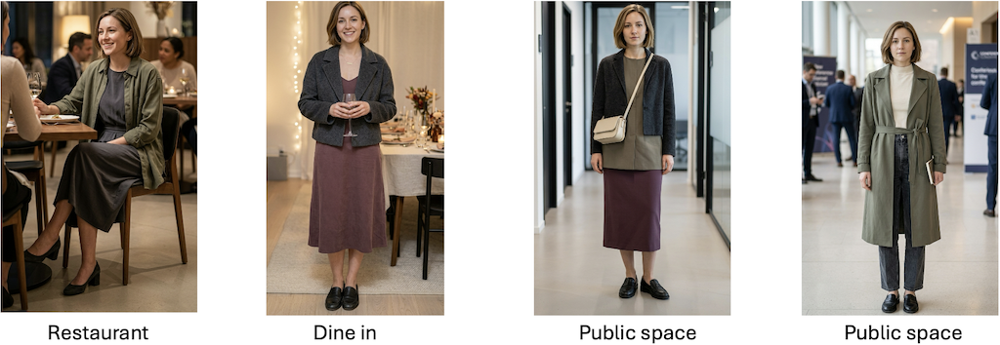
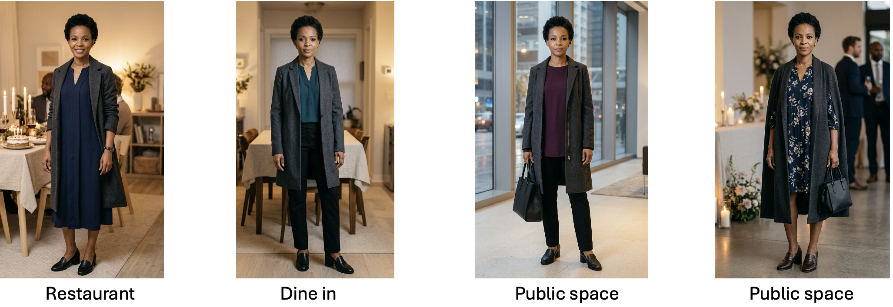
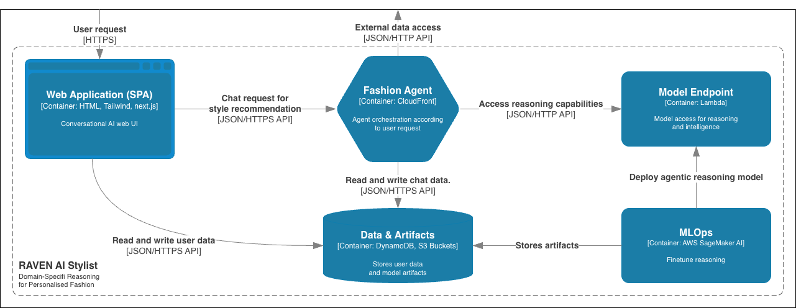
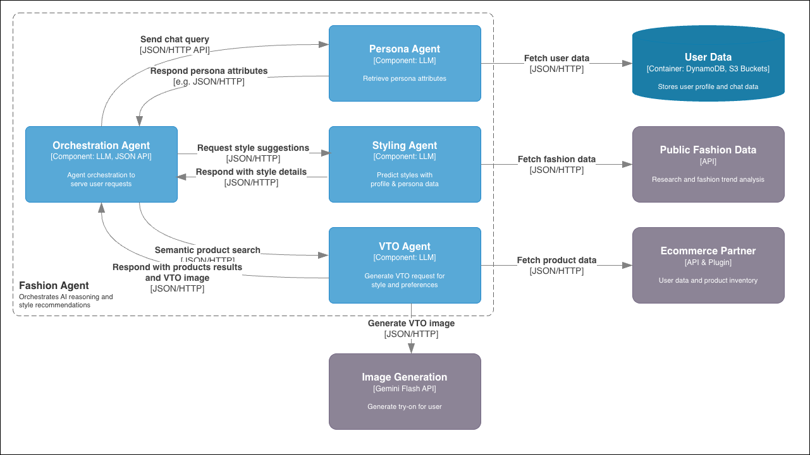
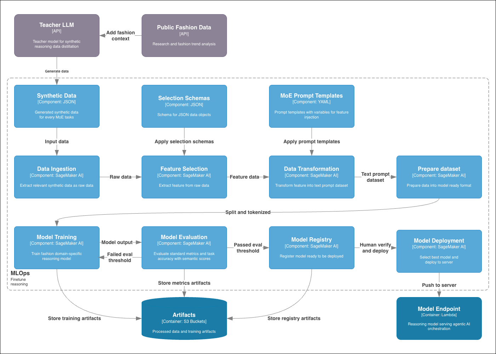
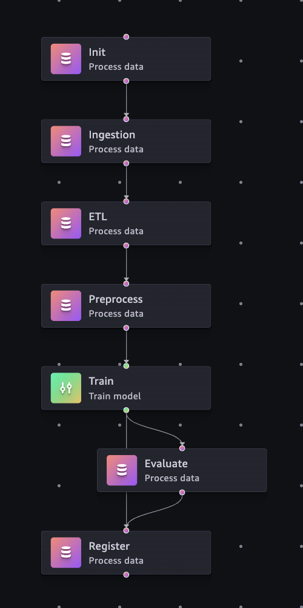
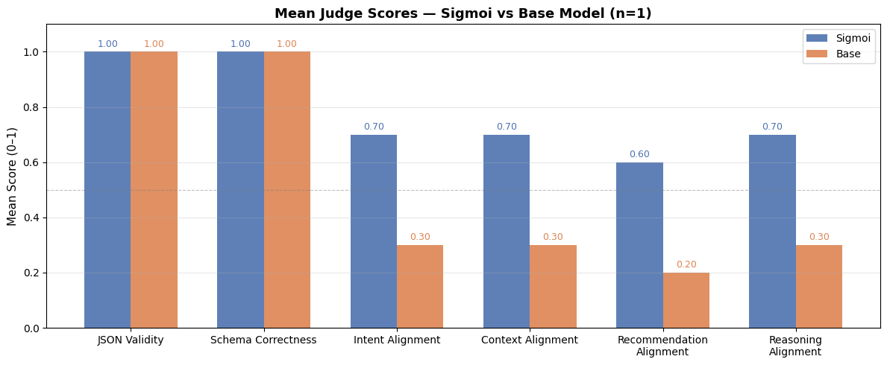
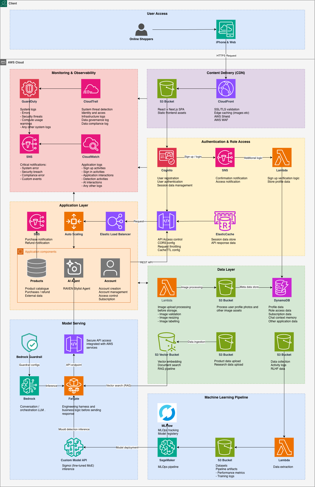

# Raven AI Stylist


## Table of Contents

- [Overview](#overview)
- [Features](#features)
- [User Journey](#user-journey)
- [Architecture Overview](#architecture-overview)
  - [Multi-Agent System](#multi-agent-system)
  - [Data Flow](#data-flow)
  - [Episode Persistence](#episode-persistence)
  - [Architecture Principles](#architecture-principles)
- [Technical Approach](#technical-approach)
  - [Tech Stack](#tech-stack)
  - [MLOps](#mlops)
- [Project Structure](#project-structure)
- [Getting Started](#getting-started)
  - [Prerequisites](#prerequisites)
  - [Local Development](#local-development)
  - [Deployment](#deployment)
- [Development Notes](#development-notes)
- [Target AWS Production Infrastructure (Future Phase)](#target-aws-production-infrastructure-future-phase)
- [License](#license)

## Overview

RAVEN is a conversational AI stylist designed for online fashion retail customers. It is built to close the gap between what customers say and what they actually mean - an emerging approach called Intent Engineering, resolved by combining immediate, contextual, and universal intent signals. At its core is Sigmoi, a domain-specific reasoning model fine-tuned from the GPT-OSS-20B Mixture-of-Experts base using supervised fine-tuning on a synthetically generated, research-guided dataset of 4,739 samples spanning style, virtual try-on, and conversational tasks. RAVEN wraps this model in a multi-agent architecture with a conversational interface and photorealistic virtual try-on, aiming to achieve intuitive UI/UX, the personalised guidance like an in-store stylist.

The project aimed to address the following:

1. More personalised and coherent recommendations with world grounding and domain specificity.
2. Conversational UI for AI-native with zero-click accessible UX for all abilities
3. Enhance reasoning in multi-agent workflow by fine-tuning MoE reasoning model
4. Democratise access for small and medium businesses with fine-tuned self-hosted model without compromising on performance
5. Reduce latency, lower compute, and remove dependency on third party foundational model API access

> NOTE: This is a distilled repository for illustrating the overall design and implementation of an end-to-end AI-native app spanning data pipeline, model training, and multi-agent applications. Separate repos contain the full agentic application and MLOps codebase.


## Features

- Profile-based persona selection
- Conversational style query interface
- Real-time outfit card generation
- AI-rendered virtual try-on images
- Feedback loop (thumbs up/down) for personalisation refinement

## User Journey

1. User selects a profile (starts new session)
2. User types style query in chat
3. System responds with outfit card
4. System displays VTO image (auto-updates canvas)
5. User provides feedback (thumbs up/down)
6. Repeat for refinement

**Note**: Switching profiles mid-session resets chat and VTO state.

**Styles illustration for different tastes**

**Maya Chen** - *Creator* <br>
**Style:** soft structure · creative professional · muted palette · textural depth · versatile dressing



**Lerato Mokoena** - *HR professional* <br>
**Style:** polished · understated · structured · modest · versatile



## Architecture Overview



A container-level view of the whole system. The web SPA is the only user-facing surface; it sends chat requests to the **Fashion Agent** (the stylist orchestrator), which is the single entry point into the backend. The orchestrator calls the **Model Endpoint** — the fine-tuned reasoning model served behind GPU instance — for reasoning, and reads and writes user and chat data in the **Data & Artefacts** store (DynamoDB + S3). The **MLOps** side sits offline in SageMaker: it fine-tunes the reasoning model, pushes training artefacts into the same store, and deploys the model to the endpoint. All interactions between containers are JSON over HTTP(S).

### Multi-Agent System

The system follows standard orchestrator + stateless-sub-agent pattern.



This zooms into the Fashion Agent container above. The **Orchestration Agent** owns the conversation: it receives each chat query, fans out to the sub-agents as stateless tool calls over JSON, and synthesises the reply. The **Persona Agent** retrieves the selected persona's attributes from the user data store; the **Styling Agent** predicts styles from profile and persona context, enriched with public fashion data; the **VTO Agent** assembles a personalised image-generation request and calls the Gemini Flash API to render the try-on image. The diagram shows the full design scope — the ecommerce-partner integration for semantic product search is a next-phase extension, and the Persona Agent's role is folded into the orchestrator in the prototype (see note below).

**Components**:
1. **Stylist (Orchestration Agent)** 
   - Stateful session management
   - Coordinates sub-agents via tool calls
   - Maintains user preference state
   - Appends conversation memory

2. **Styling Agent**
   - Processes context and returns style guides
   - Generates outfit recommendations

3. **VTO Agent**
   - Generates Gemini Flash 3.1 prompts for image generation
   - Combines user photo with outfit descriptions
   - Returns photorealistic virtual try-on images

4. **User Profile Tool**
   - Stores user profiles in JSON format
   - Provides profile list for frontend selection

NOTE: Persona Agent not implemented due to time limitations.


### Data Flow

```
User → Frontend → Stylist Orchestrator → Sub-agents → Model Inference
                        ↓                      ↓
                  Session State          Structured Output
                        ↓                      ↓
                  conversations.jsonl    Episode Bundle
```

### Episode Persistence

After each turn, orchestrator writes atomic bundle to:
```
backend/api/profiles/{user_id}/episodes/{ep_id}/
  ├── request.json
  ├── style.json (if style agent ran)
  ├── vto.json (if VTO agent ran)
  └── vto.png (if VTO agent ran)
```

All files written together or none (atomic).

### Architecture Principles
- Stylist orchestrator holds session state (stateful)
- Sub-agents are stateless functions
- Episode-based persistence with atomic writes

## Technical Approach

1. **ML Pipeline**: 6-step orchestrated workflow (SageMaker Pipelines + model deployment)
2. **Data Engineering**: Schema-driven feature extraction. Medallion Architecture data processing.
3. **Training**: QLoRA fine-tuning with Unsloth (4-bit quantisation, memory optimisation)
4. **Evaluation**: Dual-track assessment (automated model metrics + LLM-as-judge)
5. **Multi-Agent Systems**: Stateful orchestrator with stateless sub-agents
6. **Context Management**: Match training data distribution to inference patterns

### Tech Stack

**Backend**
- Python 3.x
- Custom fine-tuned GPT-OSS-20B (unsloth framework)
- AWS Lambda microservices architecture
- S3 storage for profiles and episodes

**Frontend**
- Next.js SPA
- Tailwind CSS
- Conversational UI

**Infrastructure**
- Terraform (IaC)
- AWS deployment (Lambda, S3)
- Local and remote deployment modes

### MLOps
**Pipeline Architecture**



The end-to-end training flow, from data creation to serving. A **teacher LLM** (GPT 5.4), seeded with public fashion context, distils synthetic reasoning data for every MoE task — 4,739 samples in total (Style: 2,802, Chat: 1,003, VTO: 934). The SageMaker pipeline then takes over, processing data through the **Medallion Architecture** so every stage stays traceable and inspectable: **data ingestion** extracts the raw records (**Bronze** — raw, unprocessed source), **feature selection** applies the JSON selection schemas and **data transformation** injects features into the MoE prompt templates (**Silver** — cleaned and validated), and **prepare dataset** splits and tokenises the text into ready-to-train Harmony format (**Gold** — optimised and model-ready). **Model training** fine-tunes the domain-specific reasoning model and **model evaluation** scores it against standard metrics and semantic scores — runs that fail the threshold loop back to training, while passing models land in the **model registry** for human verification and **deployment** — the approved LoRA adapter is merged with the base model and exported to GGUF (Q4_K_M 4-bit) for lightweight llama.cpp serving. Every stage persists its outputs to the S3 artefact store.

**SageMaker Pipeline Orchestration**:



The pipeline above as it actually executes in SageMaker Pipelines: `Init → Ingestion → ETL → Preprocess → Train`, with `Evaluate` branching off the trained model and both paths converging on `Register`. Each node is an isolated Python module with explicit inputs and outputs, so individual steps can be re-run without repeating the whole DAG, and the same graph runs locally in development mode.

- **SageMaker Pipelines**: Cloud-based orchestration with step dependencies
- **Local Pipeline**: Development mode with isolated run directories
- **Step Isolation**: Each step is a separate Python module with clear inputs/outputs
- **Run Tracking**: MLflow run ID propagation across pipeline steps

**Evaluation Framework**:
- **Automated Metrics**: Loss, perplexity, ROUGE, JSON validity
- **LLM Judge**: Claude Opus 4.6 scoring six target-aligned criteria (JSON validity, schema correctness, intent / context / recommendation / reasoning alignment)
- **Metric Tracking**: MLflow integration for experiment comparison
- **Quality Gates**: Conditional registration on evaluation thresholds — eval_loss ~0.9 (0.6–1.0 band; lower risks losing semantic quality), valid JSON output, LLM judge score ≥ 0.7, then human-in-the-loop approval



LLM-judge scores for the fine-tuned model (**Sigmoi**) against its GPT-OSS-20B base across the six target-aligned criteria, judged by Claude Opus 4.6 over 50 held-out style samples. Sigmoi outperforms the base on every criterion, with the clearest gaps on the dimensions that matter for personalisation — a mean of 0.82 vs 0.56 on intent alignment and 0.78 vs 0.48 on reasoning alignment. A mean judge score of 0.7 is the quality gate for conditional registration.


## Project Structure

```
raven/
├── backend/
│   ├── stylist/          # Master orchestrator agent
│   ├── style/            # Style recommendation agent
│   ├── vto/              # Virtual try-on agent
│   ├── inference/        # Model serving
│   └── api/              # User profiles & episodes
├── frontend/             # Next.js SPA
├── terraform/            # AWS infrastructure
├── notebooks/            # Training & evaluation
├── scripts/              # Build & deployment
└── docs/                 # Architecture diagrams
```

## Getting Started

### Prerequisites

- Python 3.x
- Node.js & npm
- AWS CLI (for deployment)
- llama.cpp (see `docs/llama-cpp-setup.md`)

### Local Development

```bash
# Backend
cd backend
python -m venv venv
source venv/bin/activate
pip install -r requirements.txt

# Frontend
cd frontend
npm install
npm run dev
```

### Deployment

```bash
# Infrastructure setup
cd terraform
terraform init
terraform apply

# Deploy
./scripts/deploy.sh --mode remote
```

## Development Notes

- Each component has its own CLAUDE.md for scoping
- Build components individually unless dependencies exist
- Respect component boundaries and separation of concerns
- See `backend/*/CLAUDE.md` for implementation details


# Target AWS Production Infrastructure (Future Phase)


Target production architecture for RAVEN (AWS-native), planned for a future-phase SaaS platform. It spans the full lifecycle — user access, authentication and RBAC, model serving (Bedrock orchestration with a fine-tuned custom model and RAG), the ML pipeline, and monitoring/observability. The design is a reusable reference pattern for AI-native SaaS. RAVEN currently runs locally. Next phase is MVP deployment with a subset of the architecture. This diagram represents the production target.


## License

See LICENSE file.
